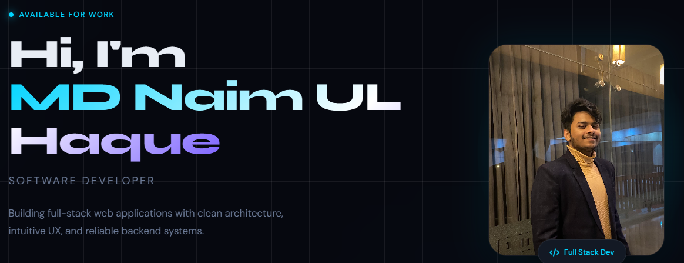

<!-- Banner Section -->

  

# 👋 Hi, I'm MD Naim UL Haque

### Software Developer

📍 **Location:** Dhaka, Bangladesh  
📧 **Email:** naimulh644@gmail.com  
🌐 **Portfolio:** [naim13107.github.io/Portfolio](https://naim13107.github.io/Portfolio/)

---

## 📖 About Me

I'm a passionate Full-Stack Developer with strong experience in Django, Django REST Framework, and React. I love building scalable and secure web applications that solve real-world problems. Currently, I'm in my final year of B.Sc. in Applied Mathematics at the University of Dhaka, constantly learning and growing as a developer.

### 🔥 Current Activities

- 🔭 I'm currently working on **advanced backend architectures** and **cloud deployment**
- 🌱 I'm exploring **Next.js** and **GraphQL**
- 👯 I'm looking to collaborate on **impactful open-source projects**
- 💬 Ask me about **Django**, **React**, or **REST APIs**
- ✨ Available for work and exciting collaborations!

---

## 🛠️ Tech Stack

### Expertise
&nbsp;&nbsp;
&nbsp;&nbsp;
&nbsp;&nbsp;
&nbsp;&nbsp;
&nbsp;&nbsp;
&nbsp;&nbsp;
&nbsp;&nbsp;
&nbsp;&nbsp;

### Comfortable With
&nbsp;&nbsp;
&nbsp;&nbsp;
&nbsp;&nbsp;

### Tools
&nbsp;&nbsp;
&nbsp;&nbsp;
&nbsp;&nbsp;
&nbsp;&nbsp;

---

## 📌 Featured Projects

### 🩸 Bondhon - Blood Donation Platform

**Overview:** A full-stack platform connecting blood donors with patients in critical need. Features emergency request tracking, automated donor health management, and integrated payment gateway for fundraising.

**🔗 Live Link:** [https://bondhon-blood-bank.vercel.app/](https://bondhon-blood-bank.vercel.app/)  
**🔗 API Server:** [https://bloodbank-teal.vercel.app/api/v1/](https://bloodbank-teal.vercel.app/api/v1/)

**🛠️ Technologies:** `Django REST Framework` `React` `Tailwind CSS` `SSLCommerz`

**✨ Key Features:**
- Real-time blood request & donor profiles
- Emergency request tracking system
- Automated donor health management
- SSLCommerz payment gateway for fundraising

---

### 🎉 EventMaster - Event Management System

**Overview:** A full-stack web application using Django (MVT architecture) with role-based access control for Admins, Organizers, and Users.

**🔗 Live Link:** [https://eventmanagement-pink.vercel.app/](https://eventmanagement-pink.vercel.app/)

**🛠️ Technologies:** `Django` `React` `Tailwind CSS` `MySQL`

**✨ Key Features:**
- Role-based access: Admin, Organizer, User
- Secure authentication & user management
- Full CRUD for event lifecycle management
- RSVP system for attendee management

---

## 🎓 Education

**B.Sc. in Applied Mathematics**  
University of Dhaka, Dhaka, Bangladesh  
Session: 2021-22 | Expected Graduation: 2026  
CGPA (up to 3rd year): 3.558

> Strong foundation in mathematical reasoning, algorithmic thinking, and problem solving — applied to real-world software development.

---

## 🤝 Leadership & Extracurricular

- **PR Executive** - Applied Mathematics Programming Society, University of Dhaka
- **Deputy Head of Programming and Development Wing** - Dhaka University IT Society
- **Member** - Notre Dame College Photography Club

---

## 🌐 Languages

- **Bangla** - Native
- **English** - Professional Working Proficiency

---

## 📫 Let's Connect!

  
  
  
  

  <i>Have a project in mind? I'd love to hear from you! ✨</i>

  

